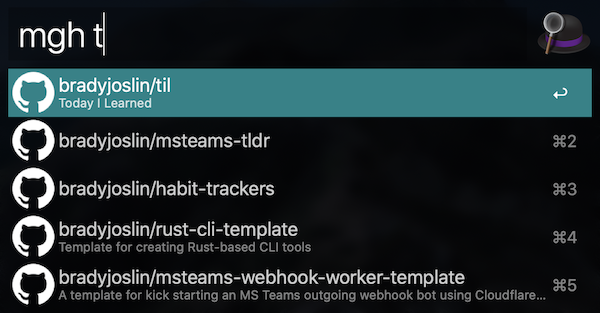
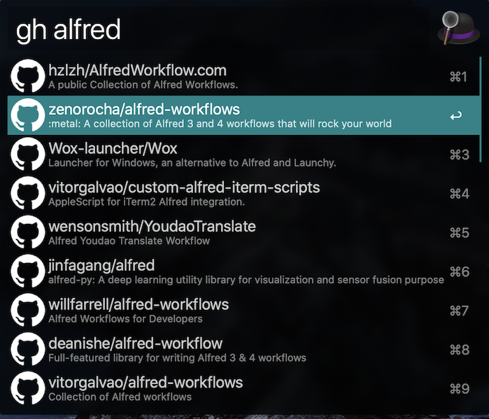

# GitHub Alfred Workflows

Rust-based [Alfred](https://www.alfredapp.com/) [workflows](https://www.alfredapp.com/workflows/) for [incrementally](https://en.wikipedia.org/wiki/Incremental_search) searching GitHub repos.

This is the first Alfred Workflow I've created, so done primarily as a learning exercise. There are two workflows created, one to search only my GitHub Repos:



Another another to search all of GitHub:



## Building

```bash
./build-workflows.sh
```

Open the two workflows created in the `Build` directory to install them in Alfred.

The `my-github-search` workflow is a slight modification to the generic `github-search` workflow with my GitHub username hard coded `{query}+user:bradyjoslin` to allow quick access to my own repos. After importing the wofkow you can modify the Script Filter script to include your username.

## How it works

The Rust program is a crude CLI app that queries `https://api.github.com/search/repositories?q={}`, taking in as argument the search criteria. The [lilyball/alfred-rs](https://github.com/lilyball/alfred-rs) crate helps parse the GitHub response to Alfred Item types.

The info.plist defines two Alfred objects as part of the workflow - a `Script Filter` and a `Run Script`. The `Script Filter` defines how Alfred should handle user input for the workflow and pass that onto the Rust CLI. `Run Script` gets the output from the CLI and obtains the URL from that output. The URL is outputted as a custom variable in the Alfred Item type and can simply be accessed in the `Run Script` object as `$URL`, without the need to do any JSON parsing. The script issues the `open` command with the URL as the argument, opening the URL in the default browser on the Mac.

## Thanks

- Francois-Guillaume Ribreau for open sourcing his Rust-based crates Alfred workflow, which is not only a great workflow, but helped serve as a reference for this one. [FGRibreau/alfred-crates](https://github.com/FGRibreau/alfred-crates)
- Lily Ballard for the [lilyball/alfred-rs](https://github.com/lilyball/alfred-rs) crate
